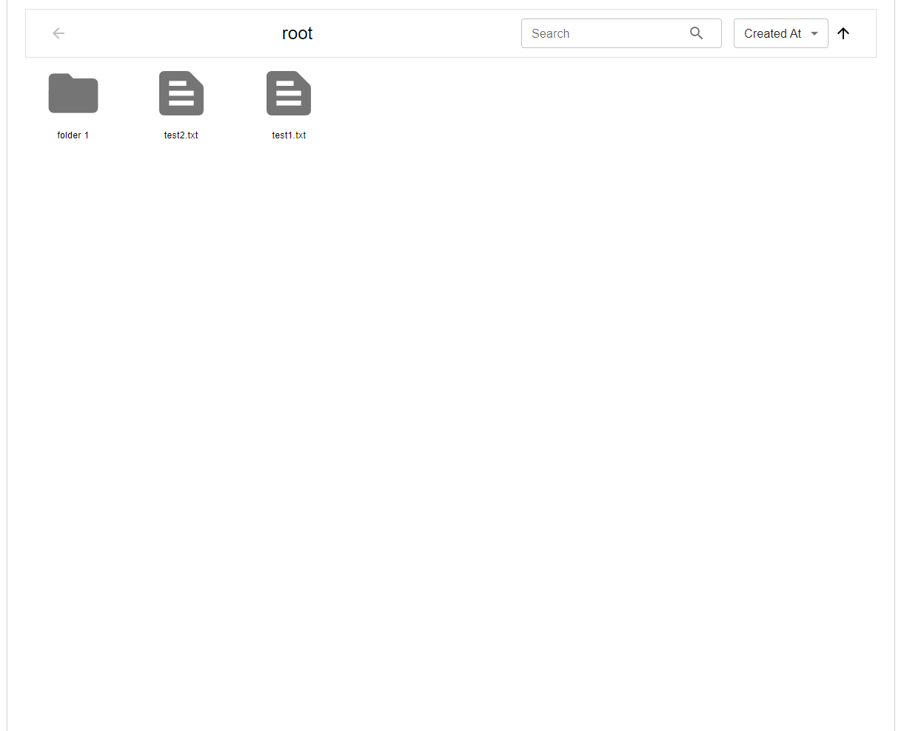
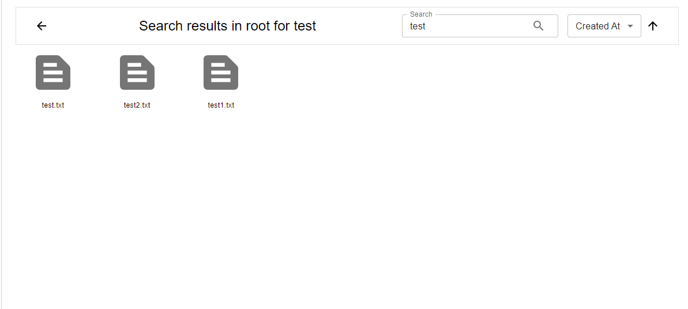
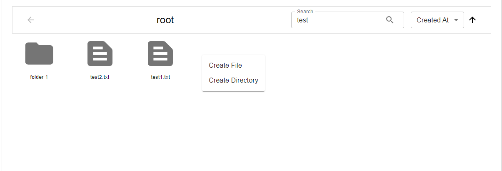
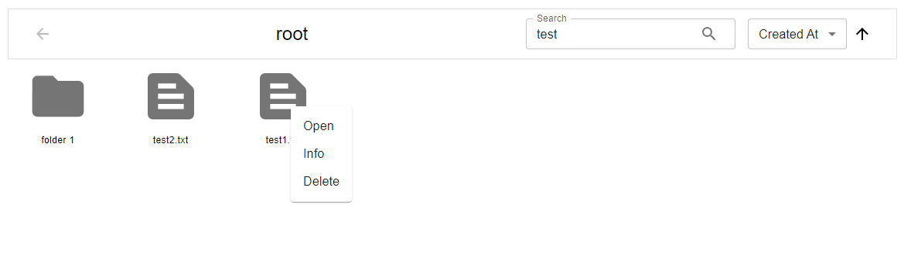
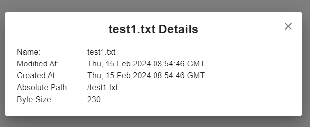
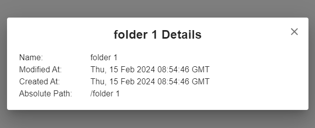
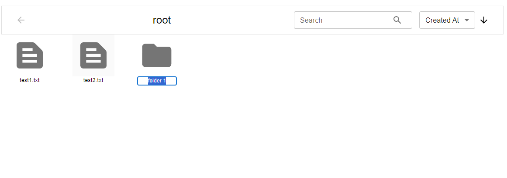
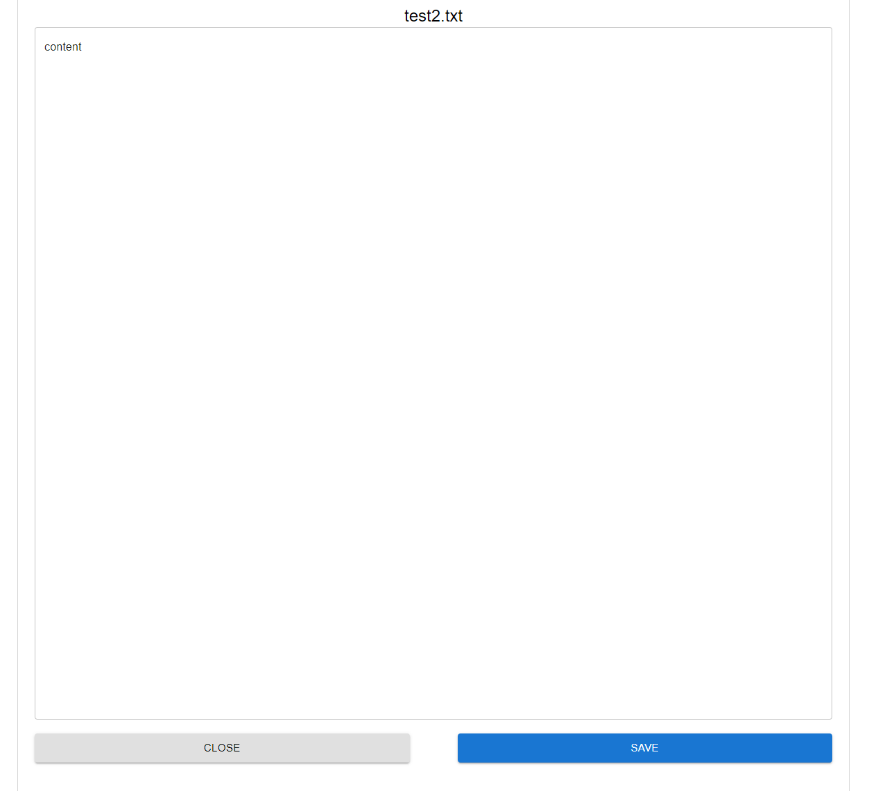
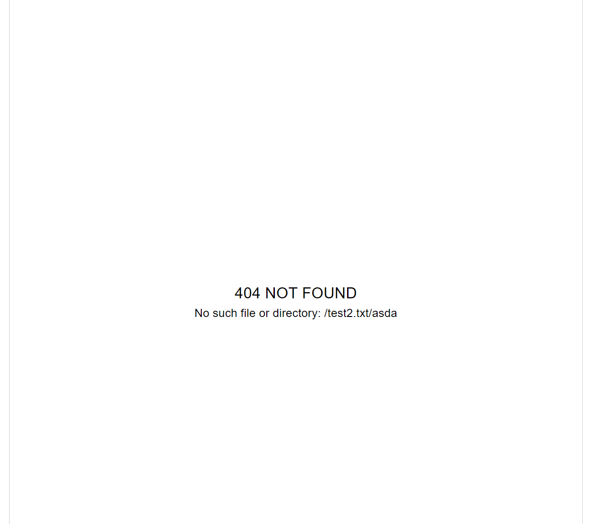
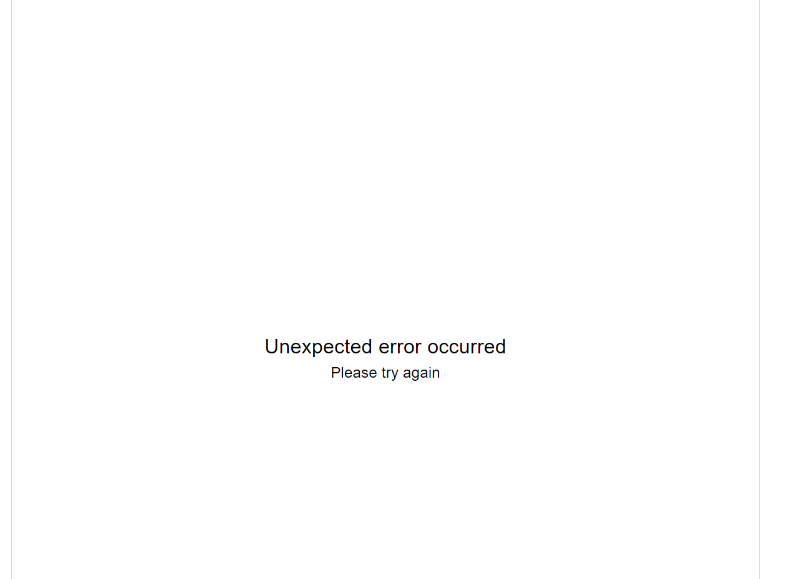

## Description
This is web frontend part for dummy files system.  
Backend url - [https://github.com/max-dmytryshyn/dummy-files-system-api](https://github.com/max-dmytryshyn/dummy-files-system-api)  
The current view depends on url which serves as a path to file or directory  
Project consists of 3 views:
- Directory
- File
- Error

## Directory view

### Directory view has the following features:
#### 1. Search
Recursively looks in current directory for all directories which have keyword in their names or files which have keyword in their names
or content.

#### 2. Sort
Can be triggered by clicking on `search icon` or pressing `Enter` button while in search keyword input.  
Sorts items by the following fields in `ASC` or `DESC` order:
- created at
- modified at
- name
- byte size (for directories it is 0)

#### 3. Go back button
- Returns to parent directory
- Disabled for root directory
- If it is a search view returns back to current directory instead

#### 4. General context menu
Allows to create file or directory. Both items are created with no content and the default name: 
`New File` and `New Folder` respectively

#### 5. Item context menu
Allows to do the following with the item:
- open
- delete
- show info dialog

  
  

#### 6. Open item
Can be triggered by double-clicking on item or via item context menu.  
Changes current url to absolute path to item and as result renders its respective view.

#### 7. Rename item
Renaming can be triggered by double-clicking on item name. After that you'll be able to edit item's name.
In order to save changes press enter or click away from name.

## File view
Allows to view and edit file content.  
After closing returns to the parent directory.  

## Error view
Shown if loading entire view fails. Other errors are shown as popups.
There are currently 2 types of these - 404 and unknown error:

  

